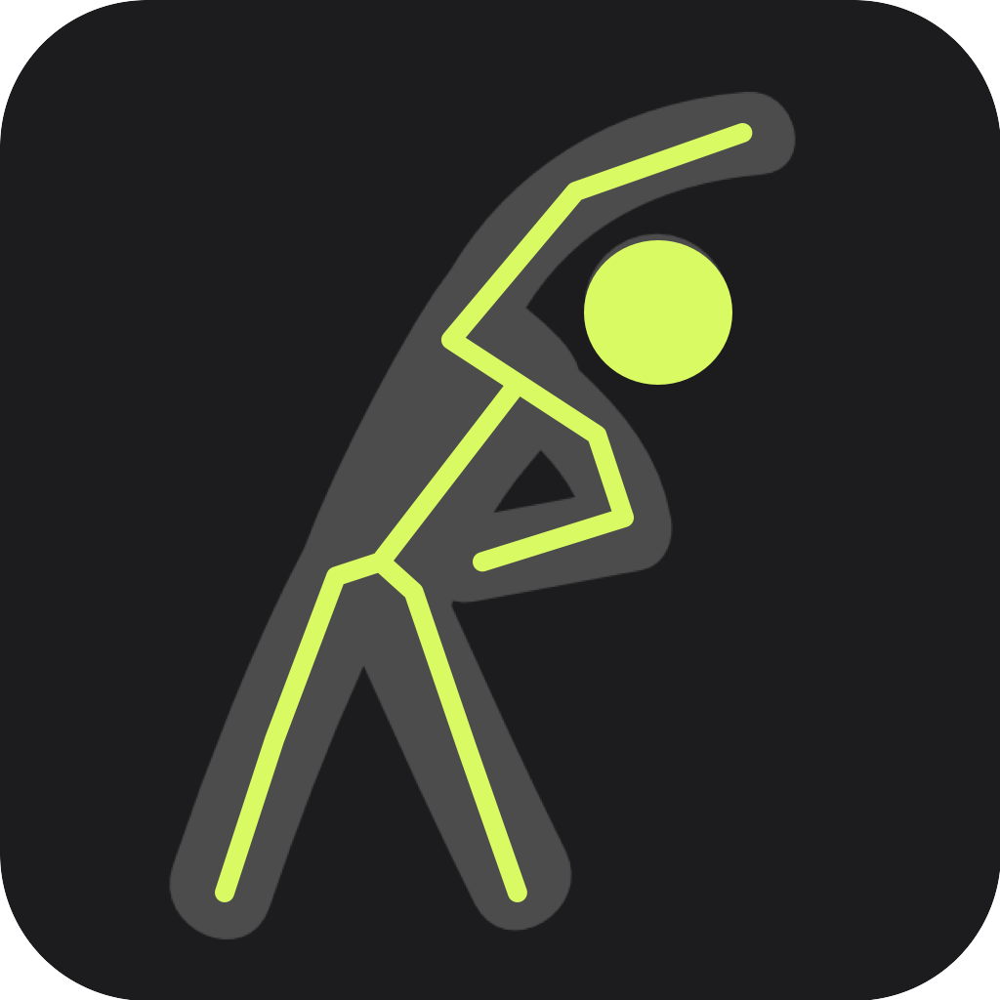
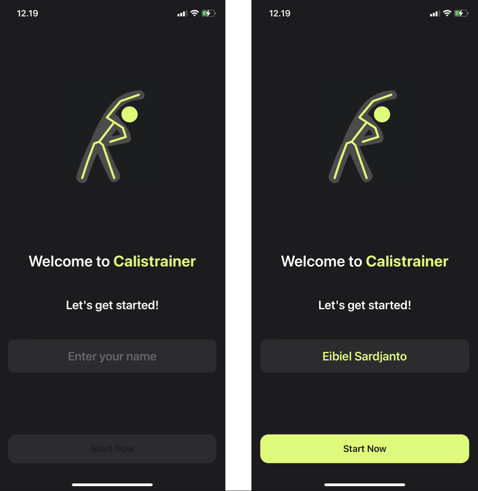
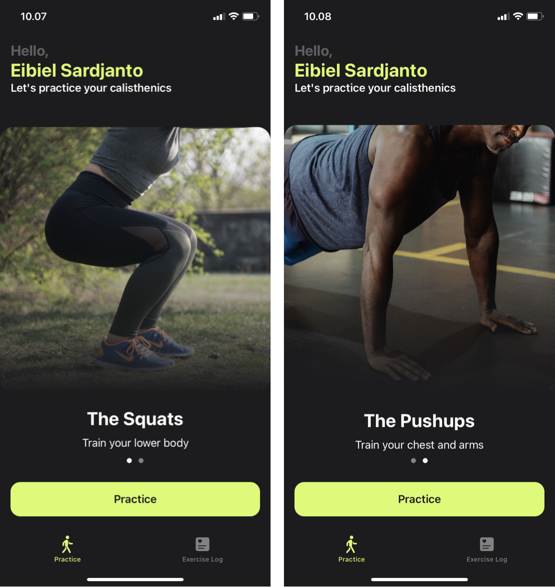
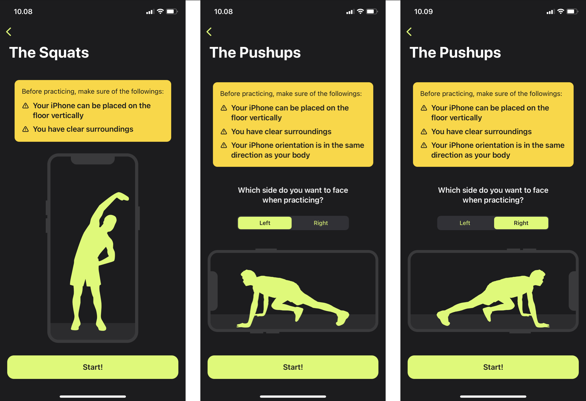
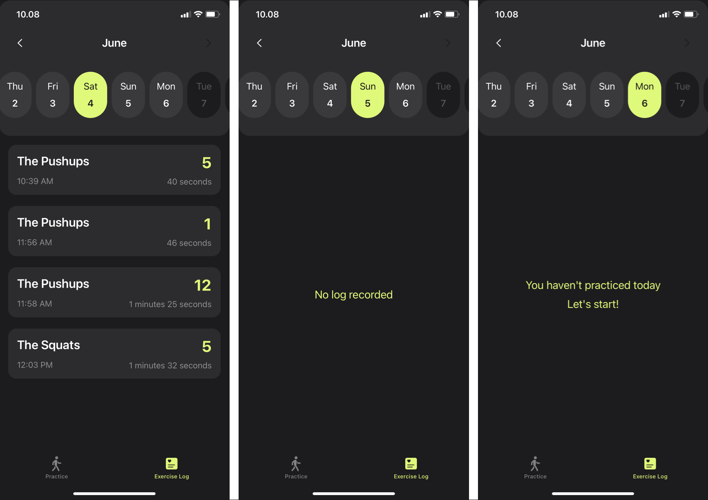

<!-- Improved compatibility of back to top link: See: https://github.com/othneildrew/Best-README-Template/pull/73 -->
<a name="readme-top"></a>
<!--
*** Thanks for checking out the Best-README-Template. If you have a suggestion
*** that would make this better, please fork the repo and create a pull request
*** or simply open an issue with the tag "enhancement".
*** Don't forget to give the project a star!
*** Thanks again! Now go create something AMAZING! :D
-->


<!-- PROJECT SHIELDS -->
<!--
*** I'm using markdown "reference style" links for readability.
*** Reference links are enclosed in brackets [ ] instead of parentheses ( ).
*** See the bottom of this document for the declaration of the reference variables
*** for contributors-url, forks-url, etc. This is an optional, concise syntax you may use.
*** https://www.markdownguide.org/basic-syntax/#reference-style-links
-->
<div align="center">

[![LinkedIn][linkedin-shield]][linkedin-url]

</div>


<!-- PROJECT LOGO -->
<br />
<div align="center">
  <a href="https://github.com/racob/calistrainer">
    
  </a>
  


<h3 align="center">Calistrainer</h3>

  <p align="center">
    An iOS app that helps beginners practice simple calisthenic exercises such as squats and push-ups based on pose estimation. The app provides accurate exercise posture and tempo feedback using audio and visual cues. The app is 100% written with Swift and native library like Vision, utilizing SwiftUI as its main UI framework.
    <br />Developed for <a href="https://drive.google.com/file/d/1mOpEm5871k5edRC5FovezJJlyOfLVNz3/view">bachelor thesis</a>
    <br />
    <br />
    <a href="https://github.com/racob/calistrainer/issues">Report Bug</a>
    ·
    <a href="https://github.com/racob/calistrainer/issues">Request Feature</a>
  </p>
</div>


<!-- TABLE OF CONTENTS -->
<details>
  <summary>Table of Contents</summary>
  <ol>
    <li>
      <a href="#about-the-project">About The Project</a>
      <ul>
        <li><a href="#built-with">Built With</a></li>
      </ul>
    </li>
    <li>
      <a href="#getting-started">Getting Started</a>
      <ul>
        <li><a href="#prerequisites">Prerequisites</a></li>
        <li><a href="#installation">Installation</a></li>
      </ul>
    </li>
    <li><a href="#usage">Usage</a></li>
    <li><a href="#roadmap">Roadmap</a></li>
    <li><a href="#contributing">Contributing</a></li>
    <li><a href="#license">License</a></li>
    <li><a href="#contact">Contact</a></li>
    <li><a href="#acknowledgments">Acknowledgments</a></li>
  </ol>
</details>


<!-- ABOUT THE PROJECT -->
## About The Project

Calisthenics has been proven to be one of the most prevalent types of physical
exercise that has been engaged throughout centuries. Its popularity may be supported
by the fact that the exercise only requires body weight to practice without the need of
additional equipment nor specific environment.

Today, beginners still have problems in practicing basic calisthenics exercises
like squats and push-ups. The problems include difficulty in maintaining exercise
tempo and difficulty in practicing the correct form and posture. Both problems are
crucial factors that hugely affect the effectiveness of calisthenics exercise.

This study approaches the problem by utilizing computer vision a mobile
smartphone front facing camera, which is an instrument that is fairly accessible to most
modern society. An iOS application named Calistrainer is developed as a solution for
beginners by providing real-time feedback on their form and posture as well as aiding
exercise tempo maintenance. The study limits the calisthenics scope to squats and
push-ups as the exercises that is available to practice on the application.

The application was evaluated by 10 respondents through usability testing and
system usability scale (SUS) methods. 100% of the participants were able to complete
given tasks using the app and 60% of them gave SUS score above 80.3, which
indicates that the application is adequately intuitive and effective in approaching the
problems experienced by beginners in practicing basic calisthenics exercises.

<p align="right">(<a href="#readme-top">back to top</a>)</p>


<!-- GETTING STARTED -->
## Getting Started

To get a local copy up and running follow these simple example steps:

### Prerequisites

* Xcode
* iPhone X and above

### Installation

1. Clone the repo
   ```sh
   git clone https://github.com/racob/calistrainer.git
   ```
2. Build and run on your iPhone

<p align="right">(<a href="#readme-top">back to top</a>)</p>


<!-- USAGE EXAMPLES -->
## Usage

### Welcome Screen


- You can enter your name here

### Home Screen


- You can choose which calisthenics exercise you want to practice (i.e. The Squats)
- Exercise logs is also available in the bottom tab bar

### Practice Setup Screen


- Relevant warnings are shown here
- You can also choose which way you're facing when practicing movements in horizontal orientation

### Practice Screen
- Make sure your whole body fits the frame
- Start exercising, while the app makes sure you practice the correct posture and tempo
- When you're finished, tap the **Finish** button

### Exercise Logs


- Your exercise sessions are recorded here
- Essential information are displayed here, such as the exercise name, repetition, time and duration of the exercise

<p align="right">(<a href="#readme-top">back to top</a>)</p>


<!-- ROADMAP -->
## Roadmap

- [x] Body-tracking and skeleton rendering
  - [x] Squat
  - [x] Push-up
  - [ ] Support more simple calisthenics exercise
- [x] Repetition counter
- [x] Posture accuracy & tempo feedback
  - [x] Visual feedback
  - [x] Audio feedback
- [x] History Logs
- [ ] Improve body-tracking accuracy

See the [open issues](https://github.com/racob/calistrainer/issues) for a full list of proposed features (and known issues).

<p align="right">(<a href="#readme-top">back to top</a>)</p>


<!-- CONTRIBUTING -->
## Contributing

Contributions are what make the open source community such an amazing place to learn, inspire, and create. Any contributions you make are **greatly appreciated**.

If you have a suggestion that would make this better, please fork the repo and create a pull request. You can also simply open an issue with the tag "enhancement".
Don't forget to give the project a star! Thanks again!

1. Fork the Project
2. Create your Feature Branch (`git checkout -b feature/AmazingFeature`)
3. Commit your Changes (`git commit -m 'Add some AmazingFeature'`)
4. Push to the Branch (`git push origin feature/AmazingFeature`)
5. Open a Pull Request

<p align="right">(<a href="#readme-top">back to top</a>)</p>


<!-- LICENSE -->
## License

Distributed under the GNU GPL v3.0 License. See `LICENSE.txt` for more information.

<p align="right">(<a href="#readme-top">back to top</a>)</p>


<!-- CONTACT -->
## Contact

Mohamad Eibiel Sardjanto - eibiel.sardjanto@gmail.com

Project Link: [https://github.com/racob/calistrainer](https://github.com/racob/calistrainer)

<p align="right">(<a href="#readme-top">back to top</a>)</p>


<!-- ACKNOWLEDGMENTS -->
## Acknowledgments

* [Using Computer Vision to Provide Real Time Feedback
and Tempo Maintenance for Calisthenics Exercise with Body Tracking on IOS Application](https://drive.google.com/file/d/1mOpEm5871k5edRC5FovezJJlyOfLVNz3/view)
* [Swift Vision framework](https://developer.apple.com/documentation/vision)
* [iOS 14 Vision Body Pose Detection: Count Squat Reps in a SwiftUI Workout App](https://betterprogramming.pub/ios-14-vision-body-pose-detection-count-squat-reps-in-a-workout-c88991f7cad4)

<p align="right">(<a href="#readme-top">back to top</a>)</p>


<!-- MARKDOWN LINKS & IMAGES -->
<!-- https://www.markdownguide.org/basic-syntax/#reference-style-links -->
[contributors-shield]: https://img.shields.io/github/contributors/racob/calistrainer.svg?style=for-the-badge
[contributors-url]: https://github.com/racob/calistrainer/graphs/contributors
[forks-shield]: https://img.shields.io/github/forks/racob/calistrainer.svg?style=for-the-badge
[forks-url]: https://github.com/racob/calistrainer/network/members
[stars-shield]: https://img.shields.io/github/stars/racob/calistrainer.svg?style=for-the-badge
[stars-url]: https://github.com/racob/calistrainer/stargazers
[issues-shield]: https://img.shields.io/github/issues/racob/calistrainer.svg?style=for-the-badge
[issues-url]: https://github.com/racob/calistrainer/issues
[license-shield]: https://img.shields.io/github/license/racob/calistrainer.svg?style=for-the-badge
[license-url]: https://github.com/racob/calistrainer/blob/main/LICENSE.txt
[linkedin-shield]: https://img.shields.io/badge/-LinkedIn-black.svg?style=for-the-badge&logo=linkedin&colorB=555
[linkedin-url]: https://www.linkedin.com/in/eibiel/
[product-screenshot]: images/screenshot.png